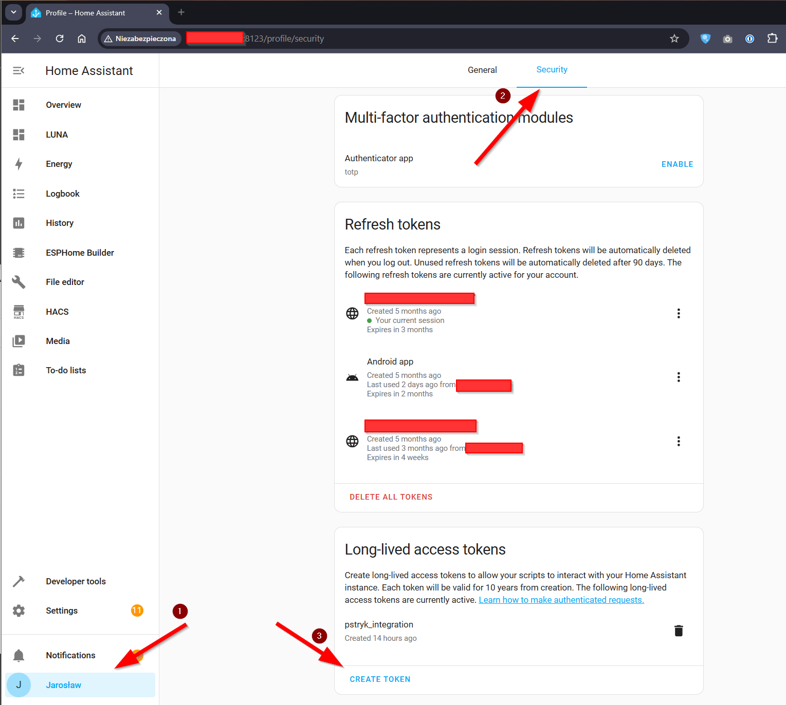
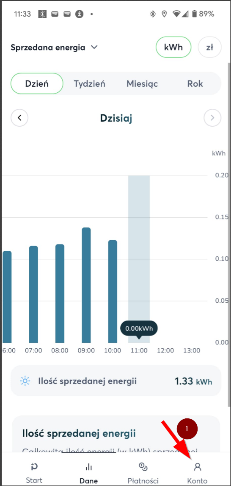
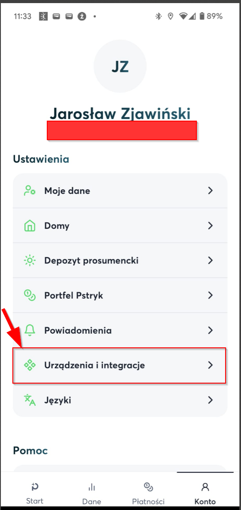
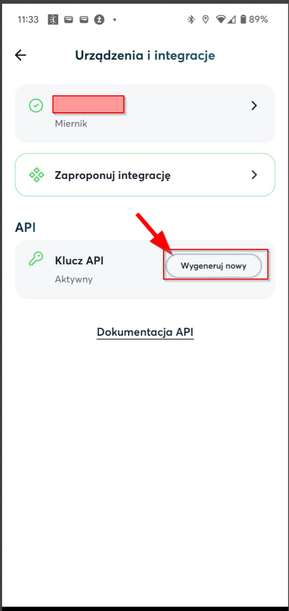

## Co właściwie to robi?
1. Pobiera dane z api.pstryk.pl 
2. Tworzy i wysyła do HomeAssistant informacje o: 
- `sensor.pstryk_current_buy` - Obecna cena sprzedaży energii elektrycznej brutto przez Pstryk (czyli cena po której kupujemy energię)
- `sensor.pstryk_current_sell` - Obecna cena zakupu energii elektrycznej brutto przez Pstryk (czyli cena po której sprzedajemy energię)
- `sensor.pstryk_current_is_cheap` - Określenie czy obecna cena energii jest tania (`true` dla tak, `false` dla nie)
- `sensor.pstryk_current_is_expensive` - Określenie czy obecna cena energii jest droga (`true` dla tak, `false` dla nie)
- `sensor.pstryk_current_cheapest` - Określenie czy obecna godzina jest najtańsza w danej dobie (od 00:00 do 23:59 dziś; `true` dla tak, `false` dla nie)
- `sensor.pstryk_next_buy` - Następna cena sprzedaży energii elektrycznej brutto przez Pstryk (czyli cena po której kupujemy energię)
- `sensor.pstryk_next_sell` - Następna cena zakupu energii elektrycznej brutto przez Pstryk (czyli cena po której sprzedajemy energię)
- `sensor.pstryk_next_is_cheap` - Określenie czy następna cena energii jest tania (`true` dla tak, `false` dla nie)
- `sensor.pstryk_next_is_expensive` - Określenie czy następna cena energii jest droga (`true` dla tak, `false` dla nie)
- `sensor.pstryk_next_cheapest` - Określenie czy następna godzina jest najtańsza w danej dobie (od 00:00 do 23:59 dziś; `true` dla tak, `false` dla nie)

## Jak pobrać token z HomeAssistant
1. Przejdź do profilu (prawy dolny róg) -> Security -> Long-lived access tokens

## Jak pobrać token z Pstryk
1. Otwórz aplikację mobilną Pstryk -> Konto (lewy dolny róg) -> Urządzenia i integracje -> API - Wygeneruj nowy
   

## Jak używać?
1. Upewnij się, że masz następujące pakiety: curl jq (`apt install -y curl jq`)
2. Umieść plik `ha.sh` w dowolnym katalogu (np. `/home/user/jarek/`)
3. Umieść wpis w crontab: `1 * * * * /home/user/jarek/ha.sh "http://homeAssistant.local:8123" "JXXD0WsJSfTzac[...]YUkIYJywndt1rqo"` Zgodnie z: `./ha.sh "PSTRYK_API_TOKEN" "HA_IP" "HA_TOKEN"`