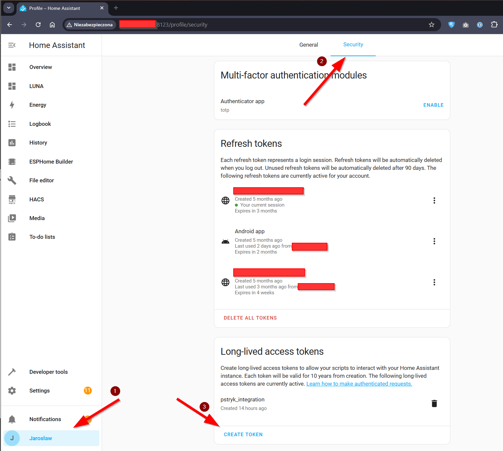
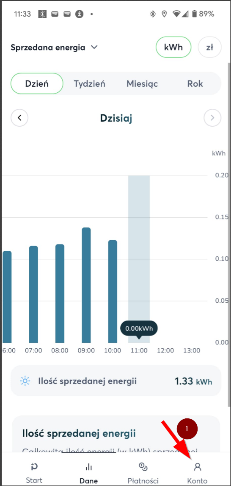
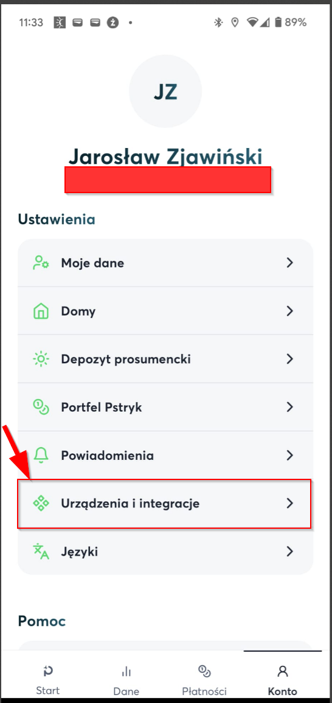
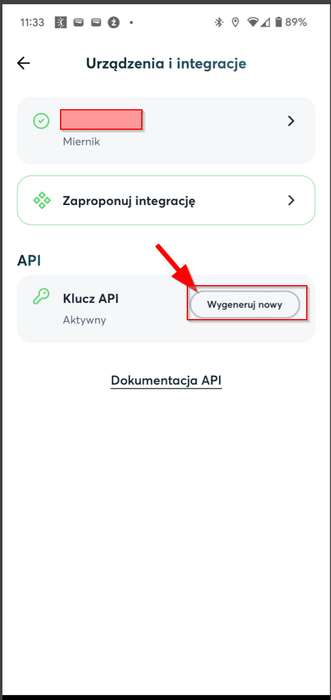

## Jak pobrać token z HomeAssistant
1. Przejdź do profilu (prawy dolny róg) -> Security -> Long-lived access tokens

## Jak pobrać token z Pstryk
1. Otwórz aplikację mobilną Pstryk -> Konto (lewy dolny róg) -> Urządzenia i integracje -> API - Wygeneruj nowy
  

## Jak używać?
1. Upewnij się, że masz następujące pakiety: curl jq (`apt install -y curl jq`)
2. Umieść plik `ha.sh` w dowolnym katalogu (np. `/home/user/jarek/`)
3. Umieść wpis w crontab: `1 * * * * /home/user/jarek/ha.sh "http://homeAssistant.local:8123" "JXXD0WsJSfTzac[...]YUkIYJywndt1rqo"` Zgodnie z: `./ha.sh "PSTRYK_API_TOKEN" "HA_IP" "HA_TOKEN"`