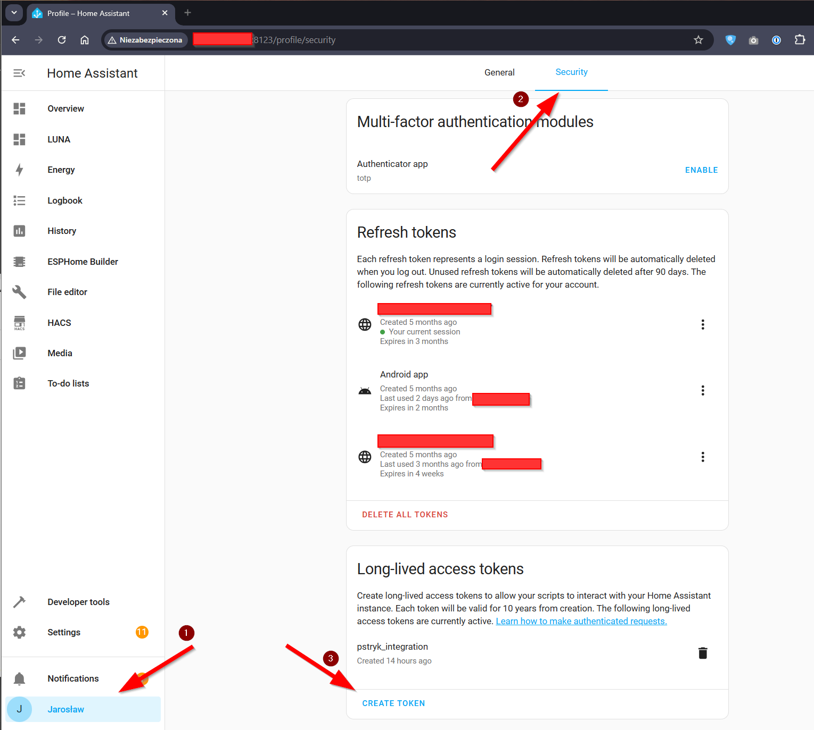
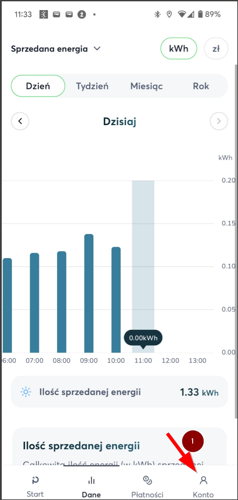
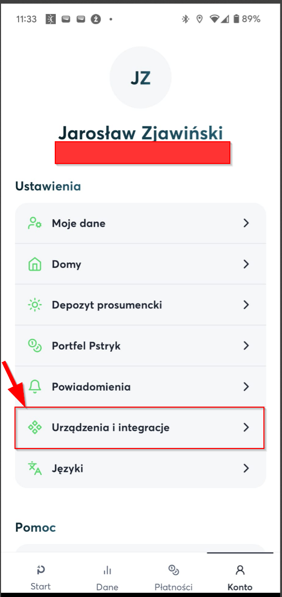
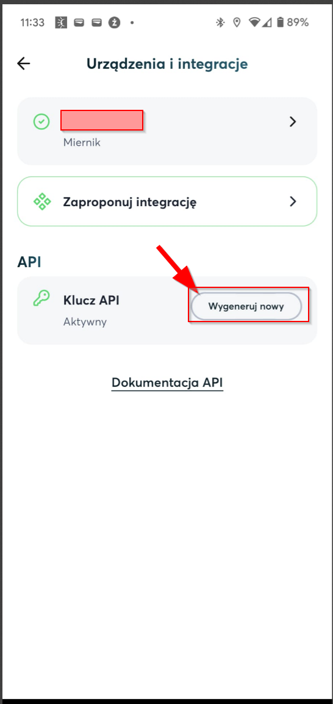

# Pstryk Home Assistant Integration

## Co właściwie to robi?

Ten skrypt integruje API cenowe Pstryk z Home Assistant, zapewniając monitorowanie cen energii w czasie rzeczywistym z inteligentnym systemem cache'owania i obsługą limitów API.

### 🔋 Główne funkcje:

1. **Monitorowanie cen energii:**
   - Pobiera aktualne i przyszłe ceny energii (zakup/sprzedaż) z api.pstryk.pl
   - Określa czy obecna/następna godzina ma tanie lub drogie stawki
   - Oblicza czy obecna/następna godzina jest najtańsza w danym dniu
   - Ranking cenowy obecnej godziny (0=najtańsza, 23=najdroższa)
   - **Automatyczne wykrywanie aktualnej godziny** z API (flaga `is_live`)

2. **Inteligentny system cache'owania:**
   - Dwupoziomowy cache: dane + znaczniki czasowe
   - Cache wygasa po 55 minutach (konfigurowalne)
   - Kodowanie base64 zapobiega korupcji danych JSON
   - Automatyczne czyszczenie uszkodzonych/starych wpisów cache
   - **Przed godziną 14:00 preferuje cache** (ceny na następny dzień dostępne dopiero od 14:00)

3. **Ochrona przed limitami API:**
   - Wykrywa ograniczenia API (komunikat: "Żądanie zostało zdławione")
   - Wykorzystuje cache jako fallback przy ograniczeniach
   - Używa najnowszego dostępnego cache jeśli bieżący jest niedostępny

4. **Wsparcie konteneryzacji:**
   - Może czytać konfigurację ze zmiennych środowiskowych
   - Gotowy do uruchomienia w Docker z odpowiednim montowaniem volumów
   - Obsługuje zarówno argumenty skryptu jak i zmienne środowiskowe

5. **Integracja z Home Assistant:**
   - Aktualizuje 53 sensory na uruchomienie
   - Ceny i rankingi dla godzin +2 i +3
   - Statystyki cenowe dnia (min/max/avg)
   - **Zużycie, koszt dobowy i ślad węglowy** (metryki `meter_values`, `cost`, `carbon`)
   - **Wartości za poprzednią pełną godzinę** (`sensor.pstryk_current_*`) — dane rzeczywiste
   - **Tablica godzinowa cen na cały dzień** (`sensor.pstryk_today_prices`) do wykresów
   - Liczba i bloki tanich godzin
   - Ranking cenowy w skali 0-23 dla precyzyjnych automatyzacji
   - Prawidłowe jednostki (PLN/kWh) i zarządzanie stanem
   - Logowanie debug dla rozwiązywania problemów

6. **Prawidłowa obsługa stref czasowych:**
   - Wszystkie obliczenia bazują na czasie warszawskim (Europe/Warsaw)
   - Automatyczna obsługa zmiany czasu letniego/zimowego (CET/CEST)
   - Ranking cenowy dla polskiego dnia lokalnego (00:00-23:00 czasu warszawskiego)
   - Dynamiczne obliczanie przesunięcia UTC (+1h zimą, +2h latem)

### 📊 Sensory tworzone w Home Assistant:

**Ceny i status bieżącej / następnej godziny:**
- `sensor.pstryk_script_current_buy` - Obecna cena zakupu energii (PLN/kWh)
- `sensor.pstryk_script_current_sell` - Obecna cena sprzedaży energii (PLN/kWh)
- `sensor.pstryk_script_current_is_cheap` - Czy obecna cena jest tania (`true`/`false`)
- `sensor.pstryk_script_current_is_expensive` - Czy obecna cena jest droga (`true`/`false`)
- `sensor.pstryk_current_cheapest` - Czy obecna godzina jest najtańsza dzisiaj (`true`/`false`)
- `sensor.pstryk_current_index` - **Ranking cenowy obecnej godziny (0-23)** gdzie `0` = najtańsza, `23` = najdroższa
- `sensor.pstryk_current_index_sell` - Ranking cenowy ceny sprzedaży bieżącej godziny (0-23)
- `sensor.pstryk_price_relative` - Stosunek ceny bieżącej do średniej dnia (>1.0 = drogo, <1.0 = tanio)
- `sensor.pstryk_script_next_buy` - Cena zakupu w następnej godzinie (PLN/kWh)
- `sensor.pstryk_script_next_sell` - Cena sprzedaży w następnej godzinie (PLN/kWh)
- `sensor.pstryk_script_next_is_cheap` - Czy następna godzina będzie tania (`true`/`false`)
- `sensor.pstryk_script_next_is_expensive` - Czy następna godzina będzie droga (`true`/`false`)
- `sensor.pstryk_next_cheapest` - Czy następna godzina będzie najtańsza dzisiaj (`true`/`false`)

**Ceny i rankingi dla godzin +2 i +3:**
- `sensor.pstryk_hour_next2_buy` - Cena zakupu za 2 godziny (PLN/kWh)
- `sensor.pstryk_hour_next2_index` - Ranking cenowy godziny +2 (0=najtańsza, 23=najdroższa)
- `sensor.pstryk_hour_next3_buy` - Cena zakupu za 3 godziny (PLN/kWh)
- `sensor.pstryk_hour_next3_index` - Ranking cenowy godziny +3 (0=najtańsza, 23=najdroższa)

**Statystyki cenowe dnia warszawskiego:**
- `sensor.pstryk_today_min_buy` - Najniższa cena zakupu dziś (PLN/kWh, uwzględnia wartości ujemne i zerowe)
- `sensor.pstryk_today_max_buy` - Najwyższa cena zakupu dziś (PLN/kWh)
- `sensor.pstryk_today_avg_buy` - Średnia cena zakupu dziś (PLN/kWh)
- `sensor.pstryk_today_min_sell` - Najniższa cena sprzedaży dziś (PLN/kWh, uwzględnia 0.00 przy nadprodukcji)
- `sensor.pstryk_today_max_sell` - Najwyższa cena sprzedaży dziś (PLN/kWh)
- `sensor.pstryk_today_avg_sell` - Średnia cena sprzedaży dziś (PLN/kWh)

**Różnice i proporcje bieżącej godziny względem dnia:**
- `sensor.pstryk_current_buy_diff_min` - Cena zakupu minus minimum dnia (0=minimum, >0=drożej)
- `sensor.pstryk_current_buy_diff_max` - Cena zakupu minus maksimum dnia (0=maksimum, <0=taniej)
- `sensor.pstryk_current_sell_diff_min` - Cena sprzedaży minus minimum dnia (0=minimum, >0=drożej)
- `sensor.pstryk_current_sell_diff_max` - Cena sprzedaży minus maksimum dnia (0=maksimum, <0=taniej)
- `sensor.pstryk_buy_relative` - Cena zakupu / średnia dnia (1.0=średnia, >1=drożej, <1=taniej)
- `sensor.pstryk_sell_relative` - Cena sprzedaży / średnia dnia (1.0=średnia, >1=drożej, <1=taniej)

**Tanie godziny i bloki:**
- `sensor.pstryk_cheap_hours_remaining` - Liczba tanich godzin pozostałych dziś po bieżącej godzinie (h)
- `sensor.pstryk_cheap_hours_today_total` - Łączna liczba tanich godzin dziś (h)
- `sensor.pstryk_next_cheap_hour` - Następna tania godzina (czas warszawski: YYYY-MM-DD HH:MM)
- `sensor.pstryk_next_cheap_block_hours` - Długość kolejnego ciągłego bloku tanich godzin (h)

**Jutro:**
- `sensor.pstryk_tomorrow_cheapest_hour` - Najtańsza godzina jutro (czas warszawski HH:MM)

**Zużycie, koszt dobowy i CO₂ (suma za dobę warszawską):**
- `sensor.pstryk_today_energy_import` - Energia pobrana z sieci dziś (kWh)
- `sensor.pstryk_today_energy_export` - Energia oddana do sieci dziś (kWh)
- `sensor.pstryk_today_energy_balance` - Bilans energii dziś (import − export, kWh)
- `sensor.pstryk_today_cost` - Koszt energii pobranej dziś (PLN)
- `sensor.pstryk_today_revenue` - Przychód ze sprzedaży energii dziś (PLN)
- `sensor.pstryk_today_net_cost` - Bilans finansowy dziś (koszt importu − wartość sprzedaży, PLN)
- `sensor.pstryk_today_co2` - Ślad węglowy dziś (g CO₂)

**Wartości za poprzednią pełną godzinę** (dane rzeczywiste — patrz uwaga niżej; atrybut `prev_hour_utc`):
- `sensor.pstryk_current_energy_import` / `_energy_export` / `_energy_balance` - Zużycie za poprzednią godzinę (kWh)
- `sensor.pstryk_current_cost` / `_revenue` / `_net_cost` - Koszt / przychód / bilans za poprzednią godzinę (PLN)
- `sensor.pstryk_current_co2` - Ślad węglowy za poprzednią godzinę (g CO₂)

> ℹ️ **Dlaczego poprzednia godzina?** Metryki `meter_values`/`cost`/`carbon` to dane **rzeczywiste** (nie prognoza). Cron uruchamia się o pełnej godzinie i 15 s, więc godzina, która właśnie się zaczęła, nie ma jeszcze danych — sensory `current_*` raportują ostatnią **zamkniętą** godzinę.

**Tablica cen na cały dzień (do wykresów):**
- `sensor.pstryk_today_prices` - Stan = data warszawska; atrybut `prices` zawiera pełną dobę godzinową w formacie `[{t, buy, sell}]`, gdzie `t` = początek godziny w UTC (ISO), `buy` = cena zakupu (`full_price`), `sell` = cena sprzedaży (`price_prosumer_gross`). Zobacz sekcję [Wykres cen na cały dzień](#-wykres-cen-na-cały-dzień-apexcharts).

### � System rankingu cenowego

Sensor `pstryk_current_index` zapewnia precyzyjny ranking cen na skalę 0-23:

- **Wartość 0:** Obecna godzina ma najniższą cenę w całej dobie
- **Wartość 1-22:** Pozycja w rankingu (1 = druga najniższa, 22 = druga najwyższa)
- **Wartość 23:** Obecna godzina ma najwyższą cenę w całej dobie

**Przykład zastosowania w automatyzacjach:**
```yaml
# Uruchom pralką tylko gdy cena jest w TOP 6 najtańszych godzin
automation:
  - alias: "Uruchom pralkę przy niskich cenach"
    trigger:
      - platform: numeric_state
        entity_id: sensor.pstryk_current_index
        below: 6  # TOP 6 najtańszych godzin (0-5)
    action:
      - service: switch.turn_on
        entity_id: switch.washing_machine
```

### 📈 Wykres cen na cały dzień (ApexCharts)

Pojedyncze sensory cenowe (`pstryk_script_current_buy` itd.) zmieniają się co godzinę, więc standardowa karta **History** pokaże tylko krzywą z godzin, które już minęły. Aby narysować **całą dobę naraz** (z godzinami przyszłymi), użyj sensora `sensor.pstryk_today_prices` — jego atrybut `prices` zawiera wszystkie 24 godziny (zakup i sprzedaż).

**Wymagany dodatek:** [ApexCharts Card](https://github.com/RomRider/apexcharts-card) (instalacja przez HACS → Frontend → „ApexCharts Card").

**Struktura danych w atrybucie `prices`:**
```json
[
  { "t": "2026-07-22T22:00:00+00:00", "buy": 1.215, "sell": 0.7163 },
  { "t": "2026-07-22T23:00:00+00:00", "buy": 1.1869, "sell": 0.6881 }
]
```
`t` to znacznik UTC (ISO) — `new Date(t)` zwraca prawidłowy moment, który karta wyświetli w lokalnej strefie przeglądarki (Warszawa).

**Konfiguracja karty (zakup + sprzedaż na jednym wykresie):**
```yaml
type: custom:apexcharts-card
graph_span: 24h
span:
  start: day          # oś od północy czasu lokalnego
header:
  show: true
  title: Ceny energii dziś (PLN/kWh)
series:
  - entity: sensor.pstryk_today_prices
    name: Zakup
    type: line
    curve: stepline
    data_generator: |
      return entity.attributes.prices.map(p => [new Date(p.t).getTime(), p.buy]);
  - entity: sensor.pstryk_today_prices
    name: Sprzedaż
    type: line
    curve: stepline
    data_generator: |
      return entity.attributes.prices.map(p => [new Date(p.t).getTime(), p.sell]);
```

> 💡 Wskazówka: `curve: stepline` daje „schodki" godzinowe (cena jest stała w obrębie godziny). Dla gładkiej linii użyj `curve: smooth`.

**Gotowy dashboard:** pełny przykładowy dashboard (wykres dobowy + cena teraz + prognoza + statystyki + zużycie/koszt/CO₂) znajdziesz w pliku [`dashboard-example.yaml`](dashboard-example.yaml). Wklej go przez Edytor nieprzetworzonej konfiguracji (Raw configuration editor) lub skopiuj pojedyncze karty.

### �🔧 Wymagania systemowe:

- `curl` - żądania API i aktualizacje Home Assistant
- `jq` - parsowanie JSON i ekstrakcja danych
- `base64` - kodowanie/dekodowanie cache
- `date` - obsługa znaczników czasowych i wygasania cache


## 🔑 Pozyskiwanie tokenów

### Jak pobrać token z Home Assistant
1. Przejdź do profilu (prawy dolny róg) → Security → Long-lived access tokens
2. Kliknij "Create Token"
3. Nadaj nazwę (np. "Pstryk Integration") 
4. Skopiuj wygenerowany token



### Jak pobrać token z Pstryk
1. Otwórz aplikację mobilną Pstryk
2. Przejdź do: Konto (lewy dolny róg) → Urządzenia i integracje → API
3. Kliknij "Wygeneruj nowy"
4. Skopiuj wygenerowany token API

   

## 🔄 Jak działa przepływ danych

1. **Sprawdzenie świeżości cache** (< 55 minut) → Użyj cache jeśli świeży
2. **Przed 14:00 czasu warszawskiego** → Preferuj cache (ceny na następny dzień jeszcze niedostępne)
3. **Jeśli cache przestarzały lub brak** → Wywołaj API Pstryk
4. **Jeśli API sukces** → Zapisz do cache + zaktualizuj Home Assistant
5. **Jeśli API ograniczone** → Użyj przestarzałego cache jako fallback
6. **Wykrycie aktualnej godziny** z flagi `is_live` w odpowiedzi API
7. **Obliczenie granic dnia warszawskiego** w UTC (obsługa DST)
8. **Ekstrakcja danych cenowych** dla obecnej/następnej godziny
9. **Obliczenie rankingu cenowego** dla polskiego dnia lokalnego
10. **Aktualizacja wszystkich sensorów** Home Assistant nowymi danymi

### ⏰ Obsługa stref czasowych

Skrypt prawidłowo obsługuje różnicę między czasem UTC (używanym przez API Pstryk) a czasem warszawskim:

| Czas warszawski | Czas UTC (zima) | Czas UTC (lato) |
|-----------------|-----------------|-----------------|
| 00:00 | 23:00 (poprz. dzień) | 22:00 (poprz. dzień) |
| 02:00 (najtańsza) | 01:00 | 00:00 |
| 14:00 (nowe ceny) | 13:00 | 12:00 |
| 23:00 | 22:00 | 21:00 |

**Przykład logów:**
```
Warsaw today: 2025-12-09
Warsaw day start in UTC: 2025-12-08T23:00:00+00:00
Warsaw day end in UTC: 2025-12-09T22:00:00+00:00
Current Warsaw offset from UTC: +1 hours

Sorted prices for Warsaw local day (index: UTC -> Warsaw local -> price):
00: 2025-12-09T01:00:00+00:00 (Warsaw: 02:00) -> 0.35
01: 2025-12-09T02:00:00+00:00 (Warsaw: 03:00) -> 0.38
...
```

## 🛠️ Rozwiązywanie problemów

### Problemy z cache
```bash
# Sprawdź zawartość cache
cat /var/tmp/pstryk_cache_timestamps.txt
base64 -d /var/tmp/pstryk_cache.txt | head

# Wyczyść cache
rm -f /var/tmp/pstryk_cache*.txt
```

### Problemy z API
```bash
# Test bezpośredniego wywołania API (endpoint unified-metrics)
curl -sG \
  -H "Authorization: TWÓJ_TOKEN" \
  "https://api.pstryk.pl/integrations/meter-data/unified-metrics/" \
  --data-urlencode "metrics=meter_values,cost,carbon,pricing" \
  --data-urlencode "resolution=hour" \
  --data-urlencode "window_start=2026-07-22T22:00:00Z" \
  --data-urlencode "window_end=2026-07-24T22:00:00Z"
```
> Uwaga: starsze endpointy `/pricing/` i `/prosumer-pricing/` zostały wyłączone (kwiecień 2026). Parametr `for_tz` **nie jest** wspierany dla `resolution=hour`.

### Problemy ze strefą czasową
```bash
# Sprawdź aktualną strefę czasową systemu
date
TZ='Europe/Warsaw' date

# Sprawdź przesunięcie UTC
echo "Warsaw: $(TZ='Europe/Warsaw' date +%H:%M) | UTC: $(TZ=UTC date +%H:%M)"
```

### Debug logów
Skrypt wypisuje szczegółowe logi na stderr. Przekieruj je do pliku:
```bash
./ha_pstryk.sh "TOKEN" "HA_IP" "HA_TOKEN" 2> debug.log
```

### Częste błędy
- **"Żądanie zostało zdławione"** → API rate limit, skrypt automatycznie użyje cache
- **"jq: parse error"** → Uszkodzone dane cache, wyczyść pliki cache
- **Brak aktualizacji sensorów** → Sprawdź token HA i dostępność endpointu 
- **"Before 14:00 Warsaw time - preferring cache"** → Normalne zachowanie, ceny na następny dzień dostępne od 14:00
- **"No is_live frame found"** → API nie zwróciło aktualnej godziny, skrypt użyje obliczeń UTC
- **Nieprawidłowy ranking cenowy** → Sprawdź czy system ma prawidłową strefę czasową 

## 🚀 Sposób użycia

### Instalacja podstawowa (tradycyjna)
1. **Zainstaluj wymagane pakiety:**
   ```bash
   apt install -y curl jq
   ```

2. **Umieść plik `ha_pstryk.sh` w wybranym katalogu:**
   ```bash
   mkdir -p /opt/pstryk-ha
   cp ha_pstryk.sh /opt/pstryk-ha/
   chmod +x /opt/pstryk-ha/ha_pstryk.sh
   ```

3. **Dodaj zadanie do crontab (uruchamianie co godzinę):**
   ```bash
   crontab -e
   # Dodaj linię:
   1 * * * * /opt/pstryk-ha/ha_pstryk.sh "TWÓJ_PSTRYK_TOKEN" "http://homeassistant.local:8123" "TWÓJ_HA_TOKEN"
   ```

### Uruchomienie w kontenerze Docker
1. **Utwórz plik docker-compose.yml:**
   ```yaml
   version: '3.8'
   services:
     pstryk-ha:
       image: pstryk-ha:latest
       environment:
         - API_TOKEN=TWÓJ_PSTRYK_TOKEN
         - HA_IP=http://homeassistant.local:8123
         - HA_TOKEN=TWÓJ_HA_TOKEN
         - TZ=Europe/Warsaw  # Ważne dla prawidłowej obsługi stref czasowych
       volumes:
         - /var/tmp:/var/tmp  # Dla trwałości cache
       restart: unless-stopped
   ```

2. **Lub uruchom bezpośrednio:**
   ```bash
   docker run --rm \
     -e API_TOKEN="TWÓJ_PSTRYK_TOKEN" \
     -e HA_IP="http://homeassistant.local:8123" \
     -e HA_TOKEN="TWÓJ_HA_TOKEN" \
     -e TZ="Europe/Warsaw" \
     -v /var/tmp:/var/tmp \
     pstryk-ha:latest
   ```

### Konfiguracja parametrów
- **Argumenty skryptu:** `./ha_pstryk.sh "PSTRYK_TOKEN" "HA_IP" "HA_TOKEN"`
- **Zmienne środowiskowe:** `API_TOKEN`, `HA_IP`, `HA_TOKEN`, `TZ` (dla kontenerów)
- **Lokalizacja cache:** `/var/tmp/pstryk_cache.txt` + `/var/tmp/pstryk_cache_timestamps.txt`
- **Czas wygaśnięcia cache:** 55 minut (można zmienić w skrypcie: `CACHE_MAX_AGE_MINUTES`)
- **Strefa czasowa:** `Europe/Warsaw` (automatycznie obsługuje CET/CEST)

### Testowanie
```bash
# Test pojedynczy
./ha_pstryk.sh "TWÓJ_TOKEN" "http://homeassistant.local:8123" "TWÓJ_HA_TOKEN"

# Sprawdzenie cache
ls -la /var/tmp/pstryk_cache*
cat /var/tmp/pstryk_cache_timestamps.txt

# Sprawdzenie ostatniej odpowiedzi API
cat /tmp/pstryk_last_api_response.json | jq .
```